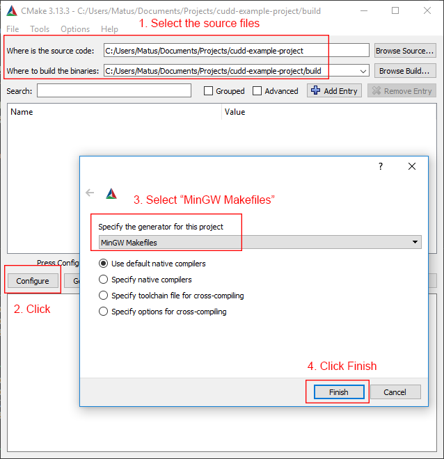

# Install for MinGW

Download and install [MinGW](https://sourceforge.net/projects/mingw-w64/) first, then make sure you have installed cmake from [here](https://cmake.org/download/#latest).

## Download and install

Download this project [as a zip file](https://github.com/matusnovak/cudd-example-project/archive/master.zip) or clone it via `git clone https://github.com/matusnovak/cudd-example-project`.

Open CMake and in the **Where is the source code?** navigate to this project. Do the same thing for **Where to build the binaries?** followed by `/build`. You don't have to use the same folder, it can be anywhere!

Then click `Configure` and select the generator as `MinGW Makefiles`, and click `Finish`. The configuration may take a minute or two.



Then click `Generate`.


Then navigate to the `build` folder, compile, and run the example.

```bash
# Go where the "Where to build the binaries?" folder is.
cd build

# Compile via cmake
cmake --build .

# Run the example
cudd-example.exe

# The dot files will be generated in cudd-example-project/build 
# relatively where your working directory is
```
