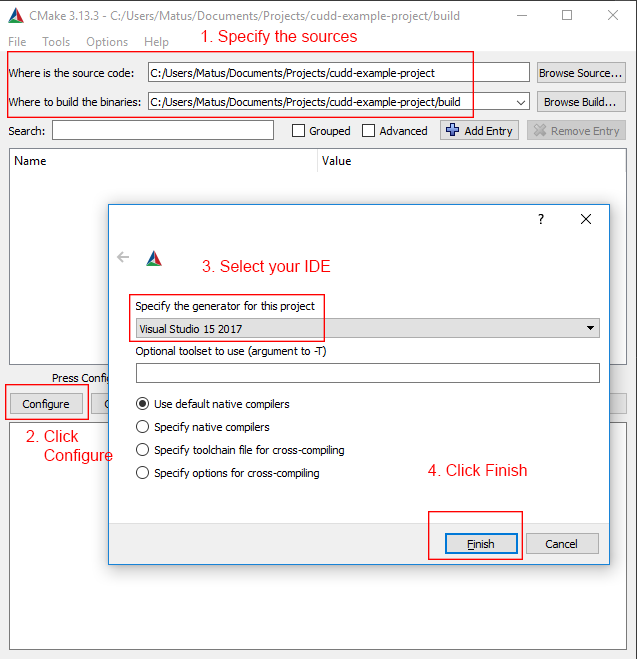
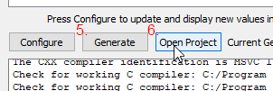
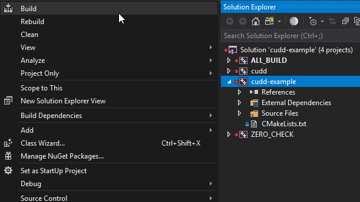
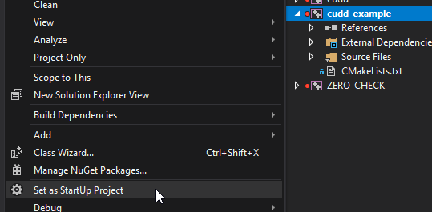
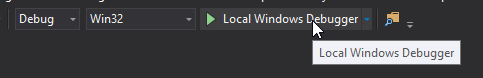

# Install for Visual Studio

Make sure you have [Visual Studio](https://visualstudio.microsoft.com/) installed. The supported versions are: Visual Studio 2013, 2015, 2017, and 2019. Then make sure you have installed cmake from [here](https://cmake.org/download/#latest).

## Download and install

Download this project [as a zip file](https://github.com/matusnovak/cudd-example-project/archive/master.zip) or clone it via `git clone https://github.com/matusnovak/cudd-example-project`.

Open CMake and in the **Where is the source code?** navigate to this project. Do the same thing for **Where to build the binaries?** followed by `/build`. You don't have to use the same folder, it can be anywhere!

Then click `Configure` and select your `IDE` as `Visual Studio`, and click `Finish`. The configuration may take a minute or two.

Then click `Generate` and `Open Project`.

Wait for the Visual Studio to open. Right click the `cudd-example` in the Solution Explorer, and select `Build`. The `cudd` library will be compiled automatically as a dependency.

Then set the `cudd-example` as the `StartUp Project`, so that Visual Studio knows what project to run. You will notice that the `cudd-example` will become highlighted with bold font.

Then simply run the program. A terminal window will open with the program's output.

**The dot files will be generated in** `cudd-example-project/build/Debug`
