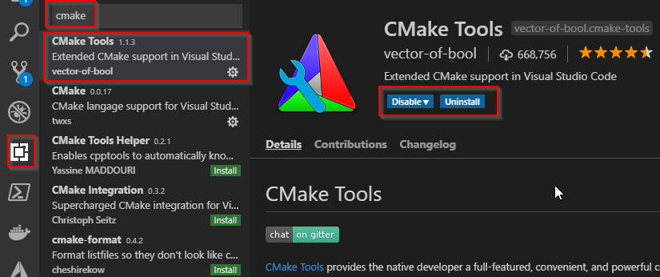
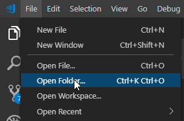
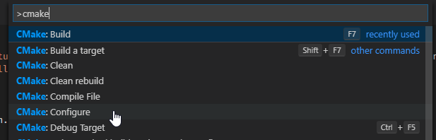
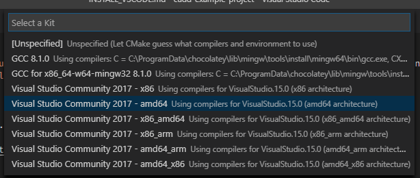
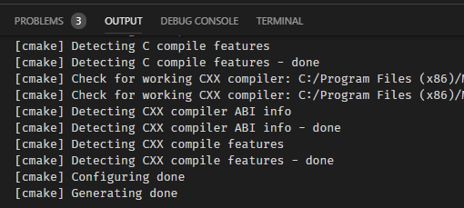
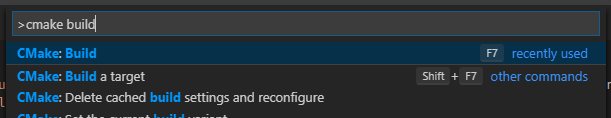
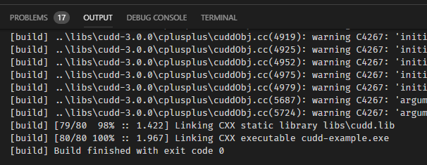
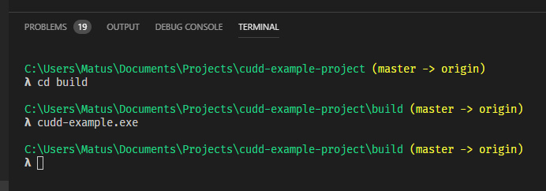
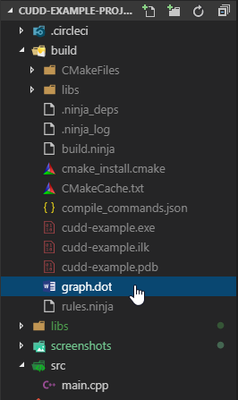

# Install for Visual Studio Code

Make sure you download [**Visual Studio Code**](https://code.visualstudio.com/) which is available on Windows, Linux, or OSX. Then, make sure you have cmake installed as well. You can install it via `sudo apt install cmake cmake-gui -y` or from [here](https://cmake.org/download/#latest).

## VS Code extensions

Install the `CMake Tools` extension.

## Download and install

Download this project [as a zip file](https://github.com/matusnovak/cudd-example-project/archive/master.zip) or clone it via `git clone https://github.com/matusnovak/cudd-example-project`.

### Step 1.

Open it via Visual Studio Code.

### Step 2.

Press `[Ctrl]+[P]` on your keyboard to bring up the VS Code action bar, and type `cmake` and select `Cmake: Configure`.

And sleect your desired compiler. If you are running on Linux or OSX, you may get only one option.

TL;DR:
* i686 -> 32bit program
* x86 -> 32bit program
* amd64 -> 64bit program
* amd64_x86 -> 64bit program

And this is the expected output:

### Step 3.

Press `[Ctrl]+[P]` again, and type `cmake build` and select the first option.

You will see something like this:

### Step 4.

Run the example. Simply, bring up the terminal. (At the top of the windows, in Visual Studio Code, select `Terminal -> New Terminal`). Once the terminal is open, navigate to the `build` directory and run the executable.

The dot files will be located in your current working directory. So, if you are in `cudd-example-project/build`, they will appear over there!

